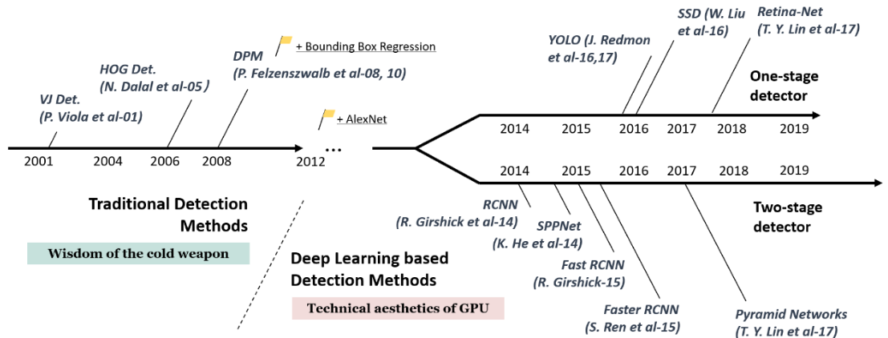
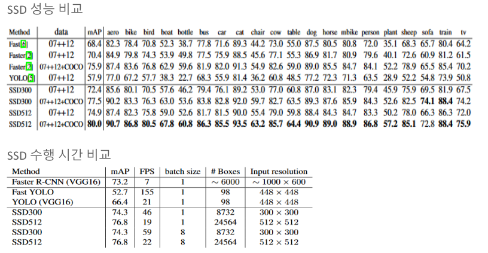
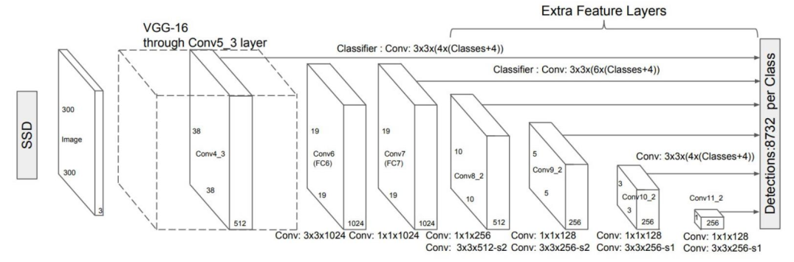
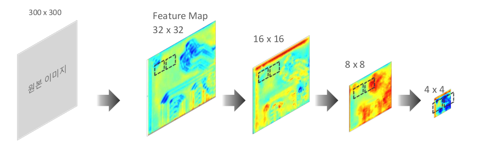
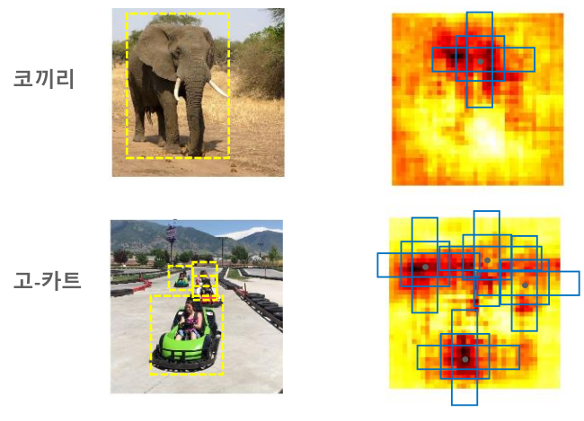
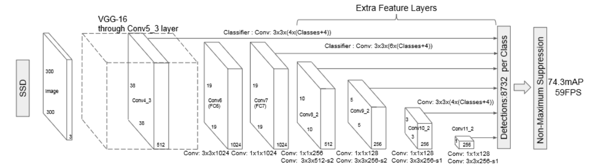
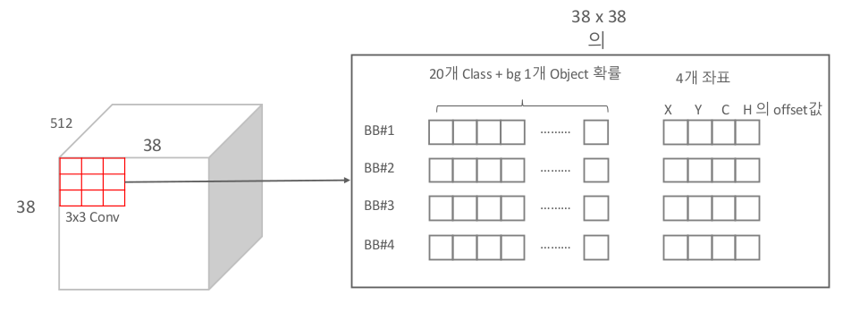
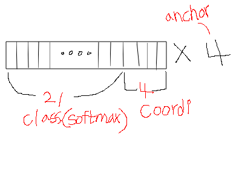

# SSD(Single Shot Detector)

Date: 2022년 5월 16일 → 2022년 5월 20일

# SSD

(Single Shot (Multibox) Detector)

## 개요

### 배경

SSD는 최초의 실용성 있는 One-stage detector라고 할 수 있다.
이전의 two-stage detector의 구조를 대략적으로 보자면
Region Proposal을 통해 나온 부분을 detector에 전달하여 regression과 classification을 수행하는두 단계로 진행이 되었다.

이러한 two-stage detector방식은 시간이 너무 오래걸려 실시간 적용이 어렵다는 등의 문제가 있었다.

### 성능

SSD이전에 One-stage detector로 발표된 모델이 YOLO v1이다. Faster-RCNN보다 약 4배 빠른 동작속도를 보였지만 현저히 떨어지는 정확도(mAP)때문에 한계가 있었다.

SSD는 이러한 문제를 극복하여 Faster-RCNN보다 정확도가 높고 YOLO v1보다 더 빠른 속도를 냈다.
따라서 SSD가 이러한 두 가지 문제를 모두 극복한 최초의 One-stage detector라고 할 수 있다.

### 구조

SSD의 구조를 간단하게 살펴보자면 위 이미지처럼 input 이미지가 classifier에 의해 점점 extraction될 때, 각각의 크기에서 feature들을 추출하여 마지막 단계에서 한번에 참고하는 구조이다.

Feature map의 크기가 다양한 상태에서 Feature를 추출하기 때문에 더욱 다양한 크기의 박스를 찾아낼 수 있다.

---

## Multi Scale Feature Map

SSD에서 핵심적으로 내세운 아이디어는 **Multi Scale Feature Map**이다.

해당 아이디어는 위에서 요약하여 설명하였듯이 각각의 Feature Map에서 Object Detection을 수행하는 것이다.

Feature Map의 크기가 클 수록(window의 크기는 고정되어있다는 전제하에) detect하는 영역이 작고
Feature Map의 크기가 작을 수록 detect하는 영역이 크기때문에(Receptive field) 다양한 크기에 대해서 detection이 가능하다.

각각의 Feature Map에서 추출한 Feature들에 대해서 Object Detection을 하는데 이때 Object Detection이라 함은 Anchor Box를 통해 classification과 Regression(IoU를 계산하여 거른 후)을 수행하는 작업이다.

---

## Anchor Box 기반의 Object Detection

이전의 Object Detection 모델들에서 Anchor box를 사용한 사례를 살펴보면( Faster RCNN밖에 없지만) Region Proposal에 사용한다. 이러한 과정을 통해 나온 영역을 기반으로 detection을 진행하는 이전의 모델 구조에서 발전하여 Region Proposal의 단계에서 Anchor box를 이용하여 classification과 Regression까지 진행하는 것이 바로 SSD의 구조이다.

SSD에서 Anchor box를 사용하는 방식은 기존의 모델과 크게 다르지는 않다,

Feature Map에서 각각의 픽셀별로 다수의 Anchor box를 가지게 되고 가장 GT와 유사한 Anchor box를 훈련시키는 과정을 거치게 된다.

즉, 해당 Anchor box가

- Anchor box와 겹치는 Feature Map영역의 Object 클래스 분류
- GT box 위치를 예측할 수 있도록 수정된 좌표

위 두 가지 정보를 가질 수 있도록 학습하는 것이다.

최종적으로 각각의 Feature Map에서 생성된 Anchor box별로

- Detection하려는 Object유형 Softmax값
- 수정 좌표값

을 전달하게 된다.

---

## SSD Network 구성

SSD는 보통 300 x 300이나 512 x 512 크기의 image를 input으로 가진다.

Feature Extractor로는 VGG나 Inception등등을 사용할 수 있다.

위 이미지에서 보이는 것들을 대략적으로 설명하자면

- 300 x 300 or 512 x 512 input image Extractor
- 각각의 Feature Map에서 conv 연산 결과 끝단으로 전달
- 모인 Feature들 IoU Confidence로 거르고 NMS하고 backprop(train 단계에서)

위 순서대로 진행된다고 볼 수 있다.

여기서 2번째 단계인 **각각의 Feature Map에서 conv연산을 하고 그것들을 모두 모으는 작업**에 집중해 보자.

결론부터 말하자면 각각의 Feature Map에 conv연산을 하는데 여기서 사용된 conv filter들이 **class확률, 좌표, anchor**를 나타낸다.

차근차근 알아보자.

왼쪽의 첫 번째 Extra Feature Layer를 예시로 볼때, conv: **3x3x(4x(Class+4))**라고 표기되어 있는 것을 볼 수 있다.

왼쪽부터 순서대로 의미하는 바는 다음과 같다.

- **3x3** : conv연산에 사용되는 filter의 높이와 너비이다.
- **(4x** : 각각의 anchor를 의미 (여기서는 4개의 anchor box를 사용)
- **(Class+** : 해당 데이터셋의 class 갯수이다. (Pascal VOC일 경우 20 + 1[background] )
- **+4))** : anchor와 GT의 offset ( w,h,x,y)

위 연산을 좀 더 공간적이고 시각적으로 표현하자면 다음과 같다.

따라서 만약 위 conv 연산을 하는데 padding = 1, stride = 1로 설정되어 있다면 결과의 dim은
**38 x 38 x ( 4 x 25 )** 일 것이다. ( 4 - anchor / 25 - class + coordinate offset )

4 x 25 channel에 대해서 좀 더 시각적으로 풀어설명하자면 다음과 같다.

(설명만으로 유추한 겁니다.. =ㅅ= )

이러한 작업을 하게되면 1개의 class에 대해서 고려해 봐도 총 8732개의 Anchor를 고려하게 되는데(Pascal VOC Dataset일 경우) 이는 모두 고려하지 않고 IoU Threshold를 넘는 Anchor box만을 사용한다고 한다.
최종적으로 NMS를 통해 결과를 return하게 된다.

---

## SSD Training

### Matching 전략

GT와 Default box간의 IoU가 특정값(0.5)이상일 경우에만 고려하여 Classification과 Regression최적화 학습을 진행한다.

### Loss 함수

%2057486583efb44ab4a77ab93e8a810d34/%EC%8A%A4%ED%81%AC%EB%A6%B0%EC%83%B7_2022-05-18_13.50.26.png?raw=true)

Loss함수의 경우 위와같이 구성되어 있으며 Classifcation과 Regression의 Loss함수를 각각 더하여 N(Match된 Default box 갯수)으로 나누어 정규화 작업후에 최종적인 Loss값을 Return하게 된다.

Classification의 Loss는 Softmax값으로 나온 값에 대해서 Cross Entropy를 적용하여 Loss값을 return한다.

Localization의 Loss는 Predicted Box와 Ground Truth사이에 Smooth L1 Loss를 사용한다.

최종적으로 이 두 값의 합에 대하여 정규화를 하면 최종 Loss값이 된다.

---

reference :  
[https://yeomko.tistory.com/20](https://yeomko.tistory.com/20)  
[https://taeu.github.io/paper/deeplearning-paper-ssd/](https://taeu.github.io/paper/deeplearning-paper-ssd/)
